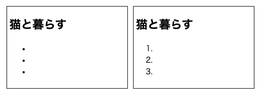
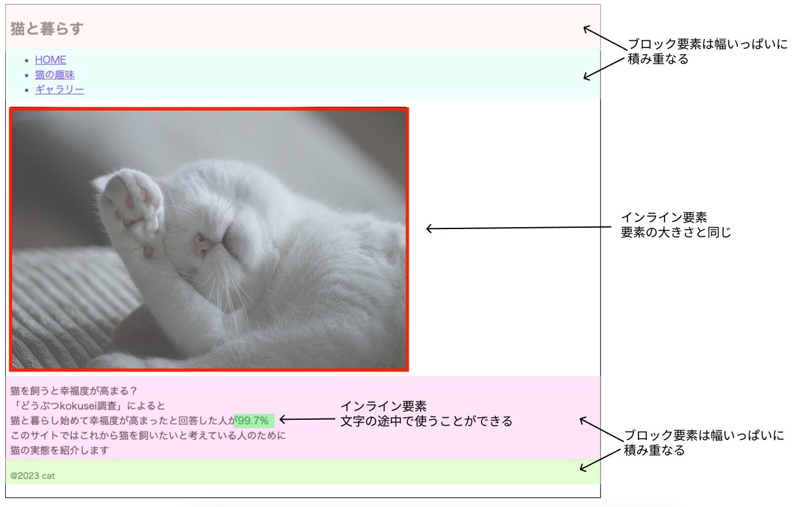
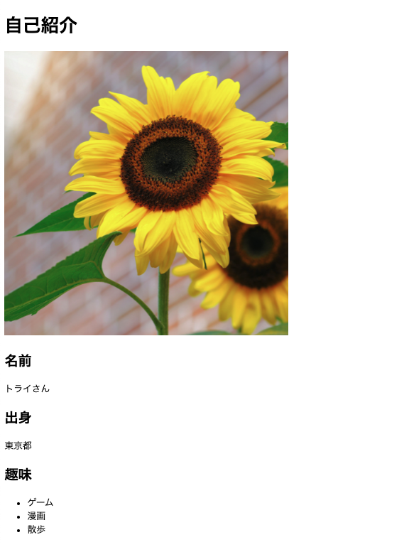

# **03_TOPページのHTML（index.html）**

## **TOPページのHTMLを書いてみよう**

- [ ] サンプルプログラムのダウンロード
- `[サンプルプログラム]>sample.zip`
- `[プログラミング]>`の中に展開
  

- [ ] ファイル・フォルダ作成(復習) 
- `[プログラミング]`の中に`[cat]`フォルダ作成
- `[プログラミング]>[cat]`の中に`[images]`フォルダ作成(画像を入れる場所)
- `[プログラミング]>[cat]`の中に>`index.html`ファイル作成 

 

  

- [ ] 命名規約　トップページのファイル名（P53）
- 拡張子
- 半角英数字
- トップページは必ず「index.html 」
  

- [ ] HTMLの書き方
- `[プログラミング]>[sample]>[html]>01_index.html`を横並びに表示
- タグの書き方　開始タグ　終了タグ
- VSCode予測入力をうまく使う
- インデント
  

- [ ] 基本構造（P54）
- `<html><head><body>`

**文字コード**

  

  

- [ ] グループ化(02_index.html)

- `<header><main><footer>`

  

- [ ] ヘッダー部分(03_index.html)

- ナビゲーション`<nav>`
- 見出し`<h1>`
- リスト`<ul>`
- `<ol>`に変えるとどうなる  
  `u`n ordered `l`ist  
  `o`rdered `l`ist  

  

- [ ] リンク(04_index.html)  
- `<a>`
- 飛び先のファイルがないとエラーになる

  

- [ ] メインビジュアル(05_index.html)
- `[sample]`>`[images]`の中の画像ファイルを`[cat]`>`[images]`にコピー
- 画像``
- パスの考え方  
  
  
  

  
  
- [ ] メインエリア(06_index.html)  
- 文字`
 `
- ``
- インライン要素・ブロック要素（``を`
`に変えるとどうなる）
- `<strong><small>`に変えてみよう
- `<a>`もインライン要素

  

  

## **自己紹介サイトの企画**

- figmaの使い方  
  https://www.figma.com/ja/
- Canvaの使い方  
  https://www.canva.com/

  

## **課題①**

- [ ] 自己紹介サイトを作ろう
- `[プログラミング]`の中に`[profile]`フォルダ作成
- `[プログラミング]>[profile]`の中に`[images]`フォルダ作成(画像を入れる場所)
- `[プログラミング]>[profile]`の中に>`index.html`ファイル作成

## **課題②**

- ベースを作る（01_index.html参照)
- グループを３つ作る（02_index.html参照)  
  （`<header><main><footer>`）

## **課題③**

- 見出し
- 画像を入れる
- 個人情報
- 記事（趣味など）

## **課題④**

- ２ページ目のリンク

  

## **参考**

  
  
