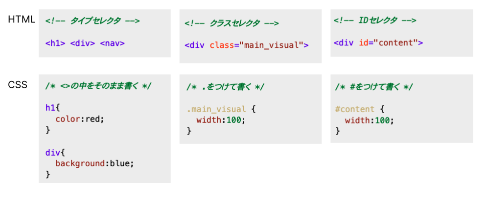
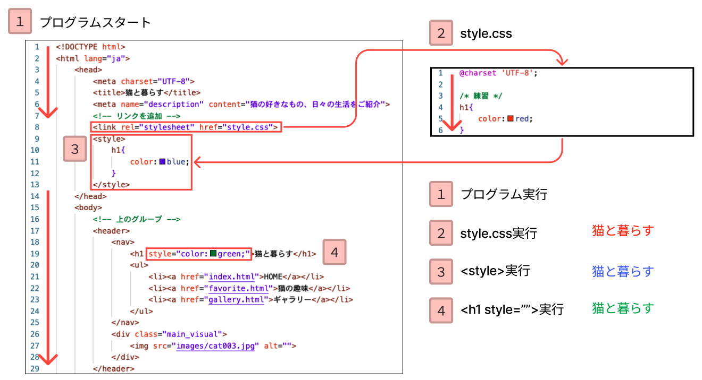
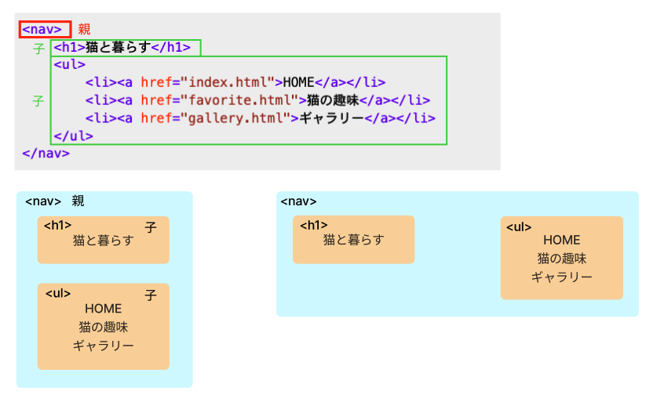
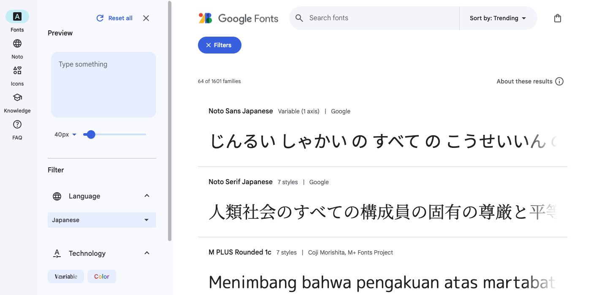
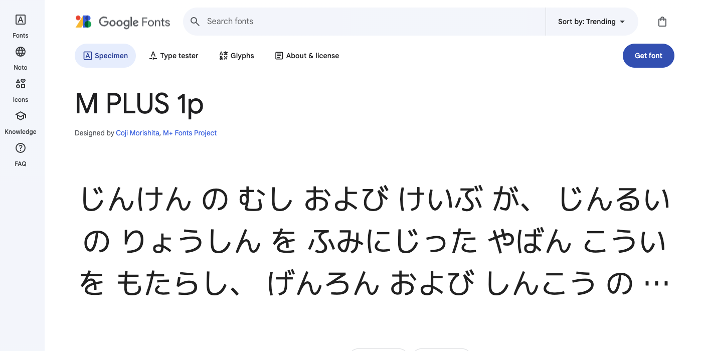
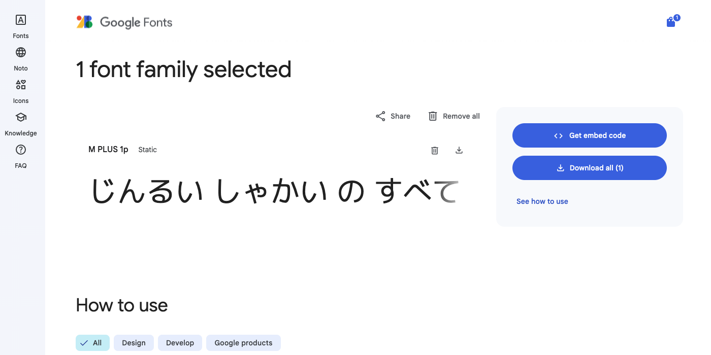
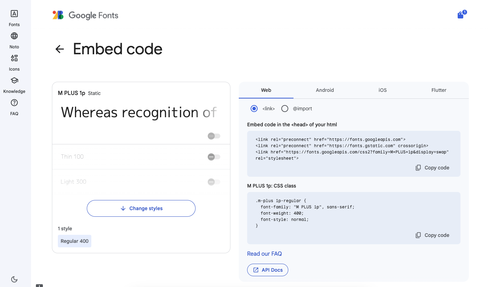
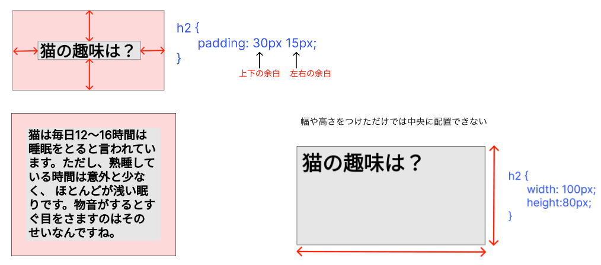
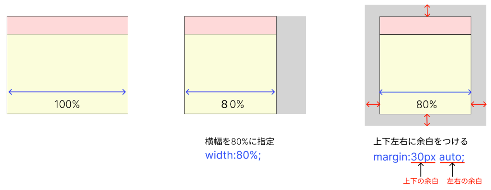

# **04_TOPページのCSS（style.css）**

## **1. CSSの基本**

**①CSSの書き方 （01_style.css）**

  
  


<br>

**②CSSを書く場所**

パターン① CSS専用のファイルを作成　HTMLで読み込んで適用  
パターン② HTMLファイル内の`<head>`の中に`<style>`タグで囲う  
パターン③ HTMLのタグに直接書く`style=""`  

パターン①の「CSSファイルを適用」させる方法が一般的です。  
特別な理由がない限りパターン②③の方法は使いません。  

<br>

**③CSSファイルの作成（復習）**

- `[プログラミング]>[cat]`の中に>`style.css`ファイル作成 

<br>

**④htmlにリンク（14_index.html）**

```html
<link rel="stylesheet" href="style.css">
```

<br>

**⑤別ファイルで作る意味（教科書P89）**

<br><br>

**⑥順次実行　後ろに書いたものが優先**  
パターン①②③の方法で書いて順番に実行されていることを確認（重要）

  

<br>

**⑦順次実行　後ろに書いたものが優先**  
セレクタによる優先順

  

<br>

```html
  <p class="text">
      猫を飼うと幸福度が高まる？<br>
      「どうぶつkokusei調査」によると<br>
      猫と暮らし始めて幸福度が高まったと回答した人が<span>99.7%</span><br>
      このサイトではこれから猫を飼いたいと考えている人のために<br>
      猫の実態を紹介します
  </p>
```

```css

.text{
    color: blueviolet;
}

p {
    color: aqua;
}

```

<br>

CSSが適用されない！おかしい！と思う時は優先順を確認してみよう！！  
セレクタの使い分けに迷う時は・・・  

<br>


## **2. TOPページのデザイン**

### **全体のCSS (02_style.css)**

広い範囲でスタイルを決めていく  
グループの外側から内側

- html,bodyに対して
- font-size
- color
- 100%=16px

<br>

  

<br>

### **headerのCSS (03_style.css)(教科書P130)**

- width
- height
- 単位の説明%
- 親子関係について（基準）

<br>

書き換えてみよう（講師実演）
```css

header {
    width: 50%;
    background-color: #054f7b;
}

nav {
    width: 30%;
    height: 10vh;
    background-color: #eaf6fd;
}

```
<br>

  

<br>

### **配置(04_style.css)(教科書P152)**

- flex
- justify-content
- 親要素子要素（復習）

  

親要素に対して`diaplay:flex;`

```css

nav {
    width: 100%;
    height: 10vh;
    background-color: #eaf6fd;
    display: flex;
    justify-content: space-between;
}

```

<br>

### **文字の装飾(05_style.css)(教科書P132)**

- font-size(rem)
- color

親要素で指定したfont-sizeの○倍  
親要素に指定がない場合は16px × 倍  

<br>

### **Webフォント(06_index.html)(教科書P104)**

- Webフォント

googleフォントを使おう

https://fonts.google.com/

  

- [Language]>[Japanese]に変更

<br>


  

  右上の[Get font]をクリック

<br>

  

<br>

  

<br>

### **リストスタイル(07_style.css)(教科書P144)**

- list-style

<br>

### **余白(08_style.css)(09_style.css)(教科書P134)**

- padding

<br>

  

<br>

### **幅と高さ(10_style.css)(教科書P130)**

- width,height
- %とpx

<br>

  
<br>

- paddingとwidth,heightの違い

<br>

  

<br>

### **背景画像(11_style.css)(教科書P122)**

- background-image

<br>

### **全体を中央に(12_style.css)(教科書なし)**

- margin auto

<br>

  

<br>

### **フッターのデザイン(13_style.css)(教科書なし)**

<br>

### **メインの文章(14_style.css)(教科書P102,103)**

- text-align
- line-height

<br>

### **角を丸める(15_style.css)(教科書なし)**

- border-radius

<br>

### **インライン要素(16_style.css)(教科書なし)**

<br>

## **再現課題一覧**

https://webgakushu2020.github.io/web/kadai/
